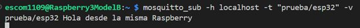
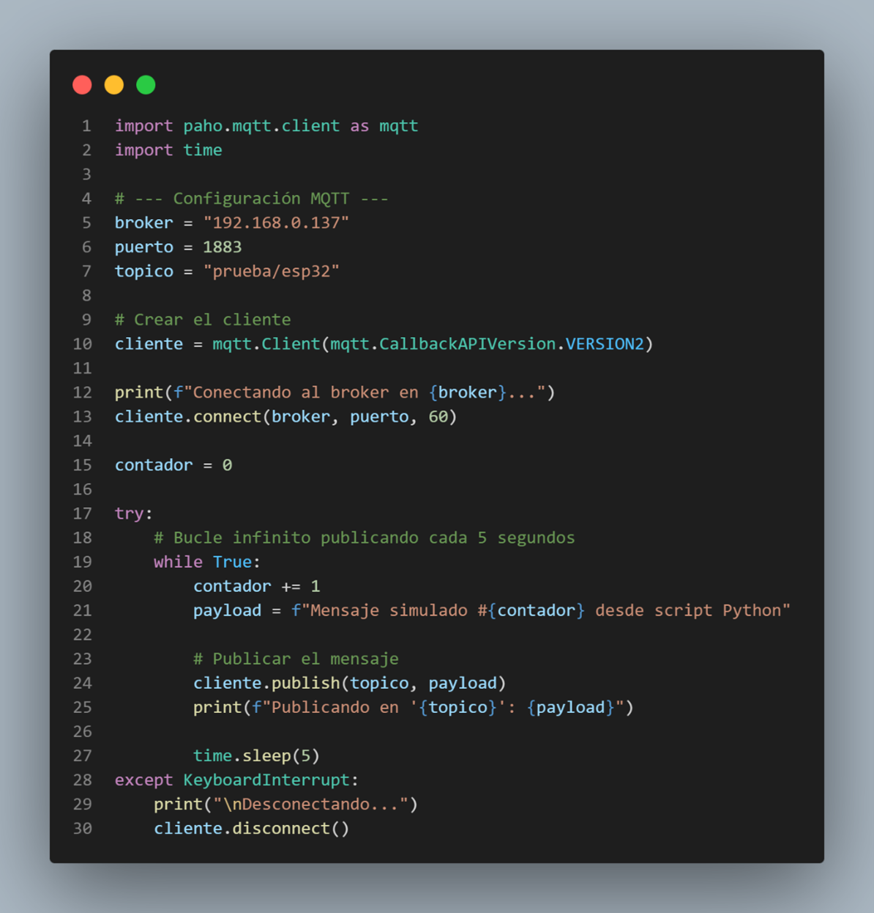
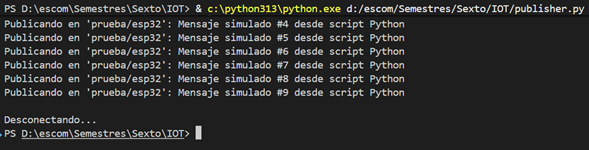
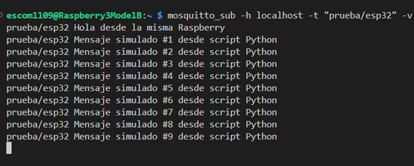

# Práctica: Servidor MQTT en Raspberry Pi y ESP32.
Integrantes: Pardo Cordova Alonso , Salgado Garmendia Enrique

Este repositorio contiene la implementación y documentación de una arquitectura IoT básica utilizando una Raspberry Pi como broker MQTT (Mosquitto) y un microcontrolador ESP32 como Publisher.

## Requisitos Hardware/Software
* Raspberry Pi (con Mosquitto instalado y ejecutándose como servicio)
* ESP32 (Programado vía Arduino IDE)
* Librería `PubSubClient` para Arduino

## Estructura del Proyecto
* `/src`: Código fuente en C++ para la ESP32 y codigo fuente de python usado como prueba.
* `/evidencias`: Capturas de pantalla comprobando la comunicación.

## Instrucciones de Configuración

### 1. Broker MQTT (Raspberry Pi)
El servicio de Mosquitto se inicia automáticamente en la Raspberry Pi. Para suscribirse a los mensajes entrantes, ejecutar:
\`\`\`bash
mosquitto_sub -h localhost -t "prueba/esp32" -v
\`\`\`

### 2. Nodo Publisher (ESP32)
1. Abrir el archivo `.ino` en Arduino IDE.
2. Modificar las variables `ssid` y `password` con las credenciales de la red local.
3. Actualizar la variable `mqtt_server` con la dirección IP de la Raspberry Pi.
4. Compilar y cargar a la placa.

## Evidencia de Funcionamiento

Terminal 1 (Subscriber):

Terminal 2 (Publisher):

Ejecución de Publisher en ESP32.
Nota: Debido a que no contamos con la ESP32 se decidió hacer un programa en Python que hiciera el mismo proceso que la esp32.

Código del script en Python:

Terminal Python:

Terminal Raspberry:

 

